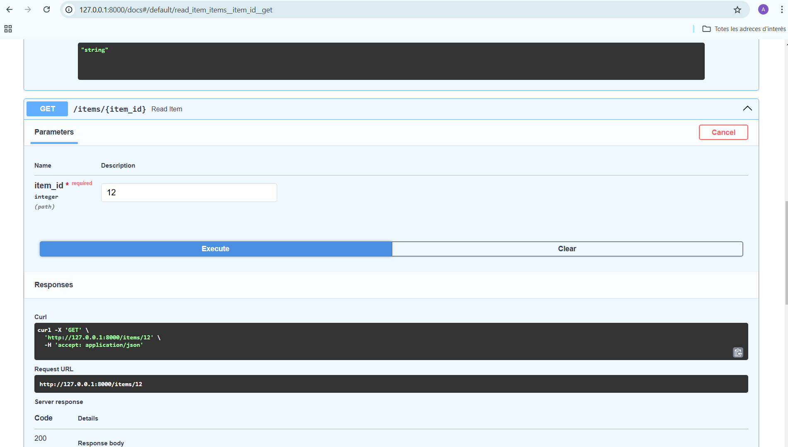
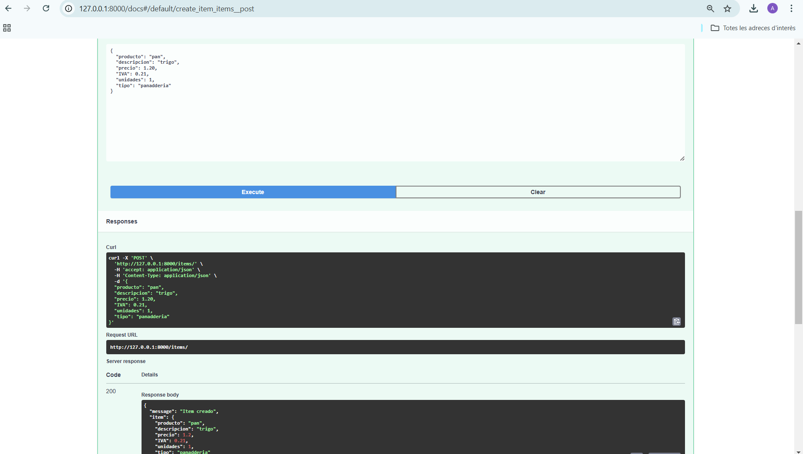
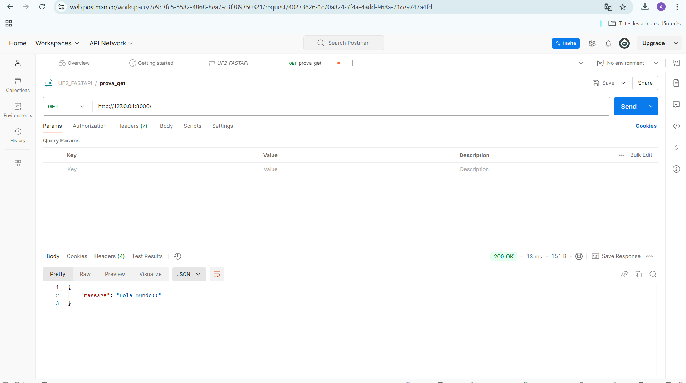
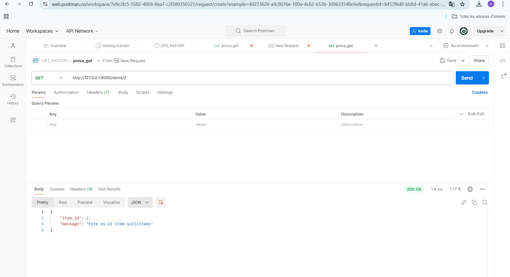
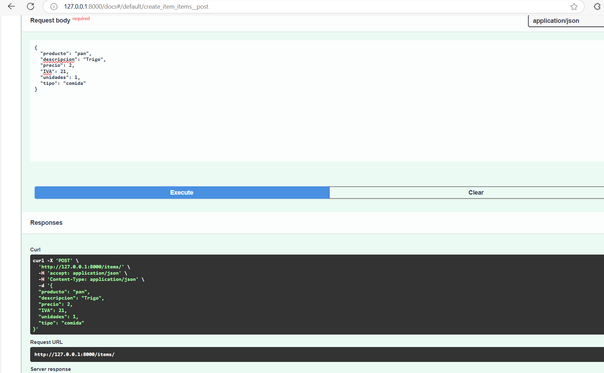

# UF2_FASTAPI

## Ejemplo de Swagger

Esta captura muestra la interfaz principal de Swagger con nuestro primer cambio i nuestra primera insercion del get con el hola mundo, y el id del que queremos poner.

## Otra vista de Swagger

Aquí ya tenemos Swagger con las 6 casillas completas que representan un producto ,su precio ,descripcion.Con su tipo integer ,float...
Con su URL i el numero 200 que representa que todo esta bien.

## Primera prueba con Postman
Una vez ya tenemos el post man lo que hacemos es poner la URL que sale en el swagger de la fast api , asi estaremos conectados ,i nos devolvera el texto segun el metodo que escogamos ,get,post...
Y nos lo mostrara en formato json 

## Respuesta en Postman

En esta captura se puede observar la respuesta a la petición en Postman  la segunda que hemos hecho que saca la informacion segun el nombre de la id.

## Vista final de Swagger

Aquí está la pantalla final después de completar todas las pruebas en Swagger, en la que nos salen ya todos los productos con sus datos segun su tipo

