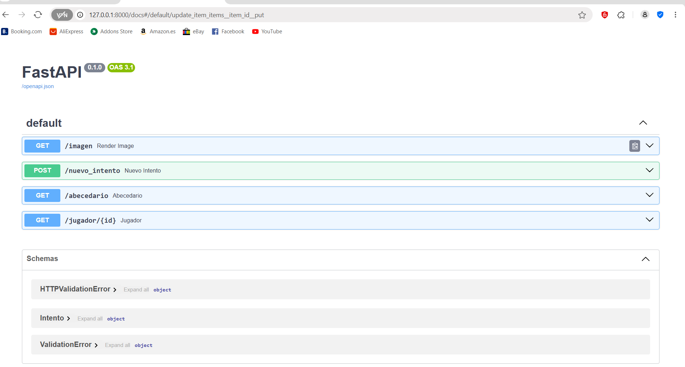
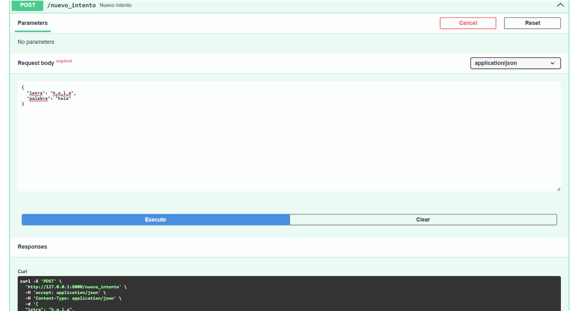
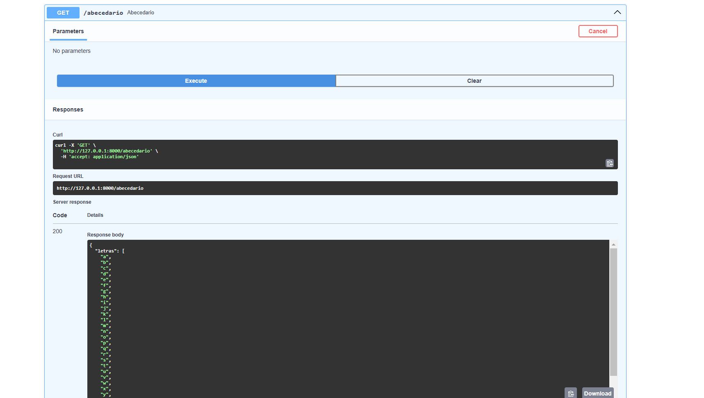
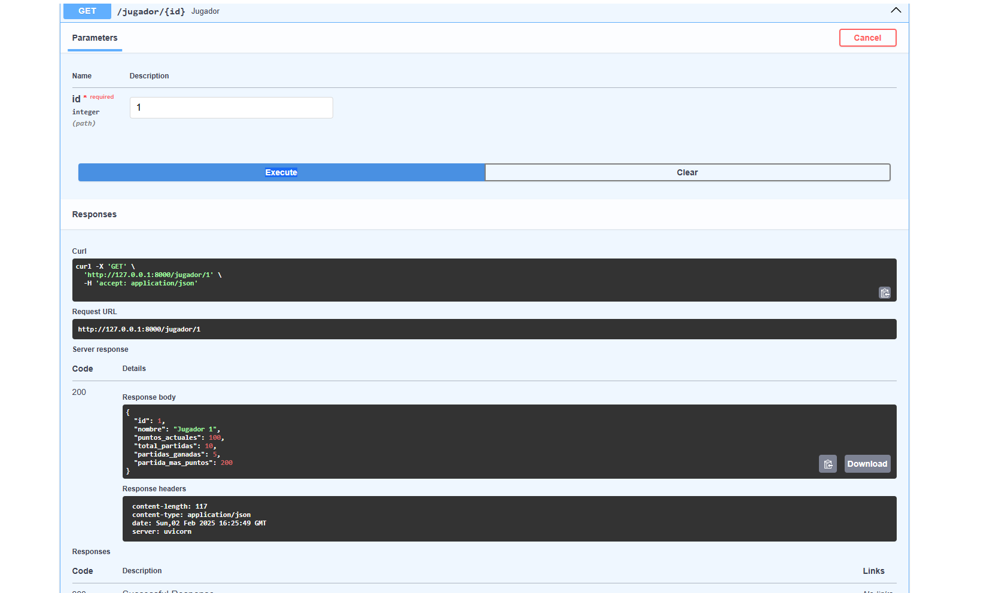

# Documentació de l'API amb Swagger UI ACT 11

En aquesta secció, et mostrem com interactuar amb els diferents endpoints de l'API utilitzant Swagger UI. A continuació, es mostren captures de pantalla dels endpoints creats.

## Captures de Pantalla de Swagger UI

### 1. **Interfície Principal de Swagger**
   Aquesta és la pantalla principal de Swagger UI on pots veure tots els endpoints de l'API i fer sol·licituds directament des de la interficie.

   

### 2. **Endpoint de intent**
   Aquí pots veure com es fa una sol·licitud `POST` per registrar un nou intent al joc. En aquest formulari pots introduir la lletra i la paraula.

   

### 3. **Veure les Lletres de l'Abecedari**
   Aquest és l'endpoint que et retorna totes les lletres de l'abecedari. Pots fer una sol·licitud `GET` i obtenir la llista de lletres.

   

### 4. **Obtenir Informació del Jugador**
   En aquesta captura, pots veure com obtenir la informació d'un jugador específic utilitzant el seu ID. La sol·licitud és de tipus `GET` a l'endpoint `/jugador/{id}`.

   

## Com Provar l'API

1. Accedeix a la documentació interactiva de Swagger UI a la següent URL:

   [Swagger UI de l'API](http://127.0.0.1:8000/docs)

2. Des d'allà, pots provar tots els endpoints, fer sol·licituds `GET`, `POST` i veure les respostes de manera interactiva.

## Y aqui una imatge del postgres amb les taules i triggers creats
   [Postgres](ACTIVITAT_11/imatges/psql.png)

