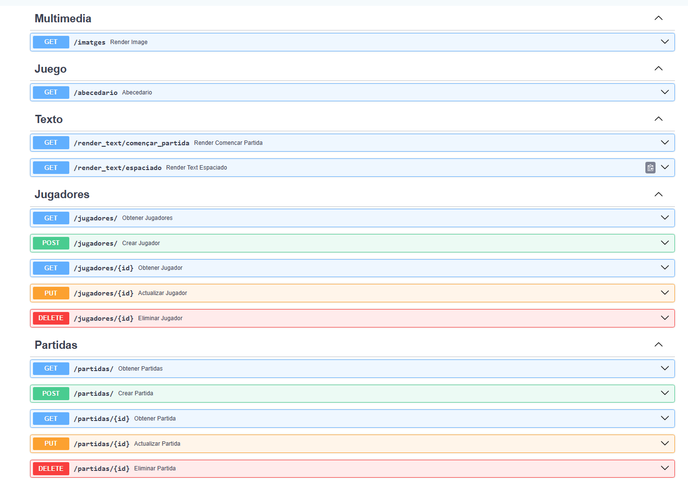
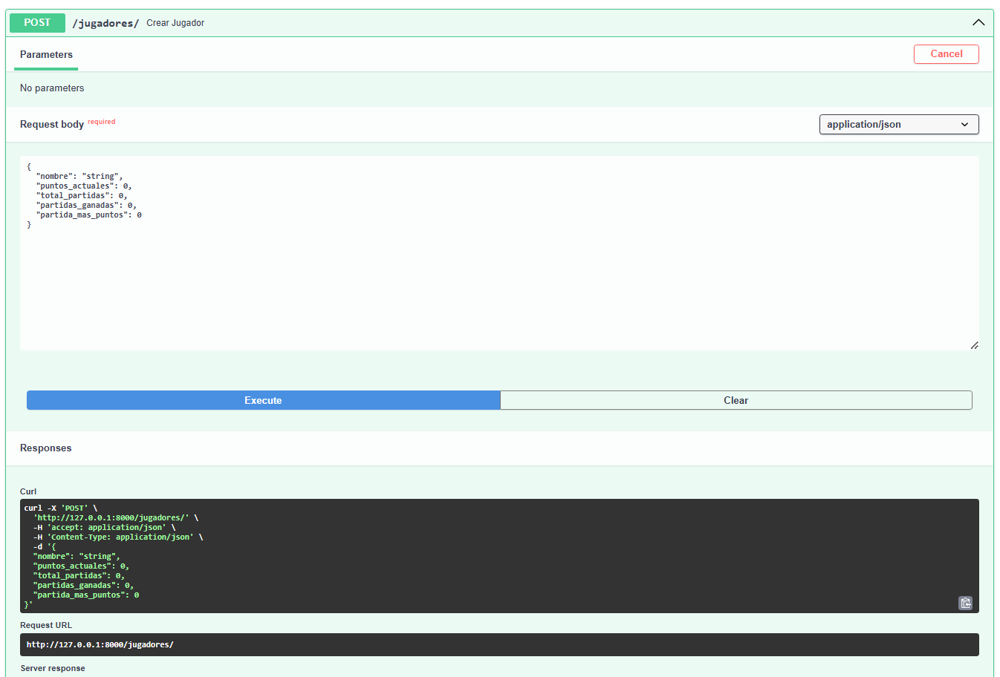
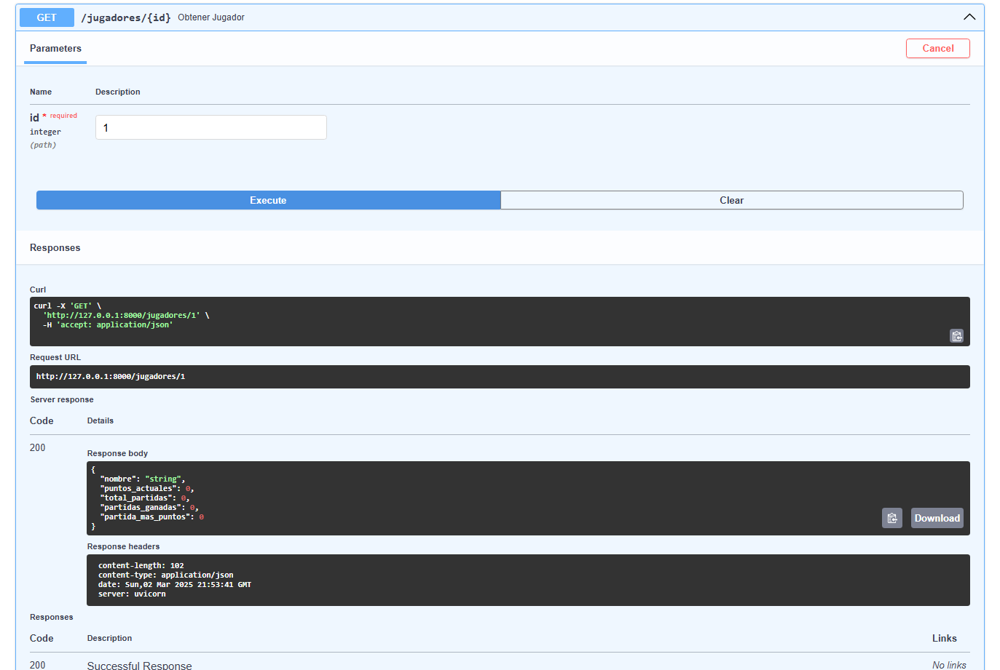
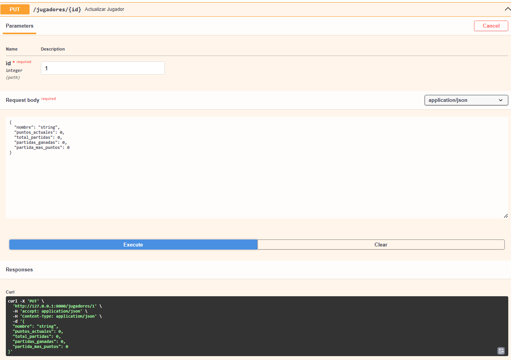
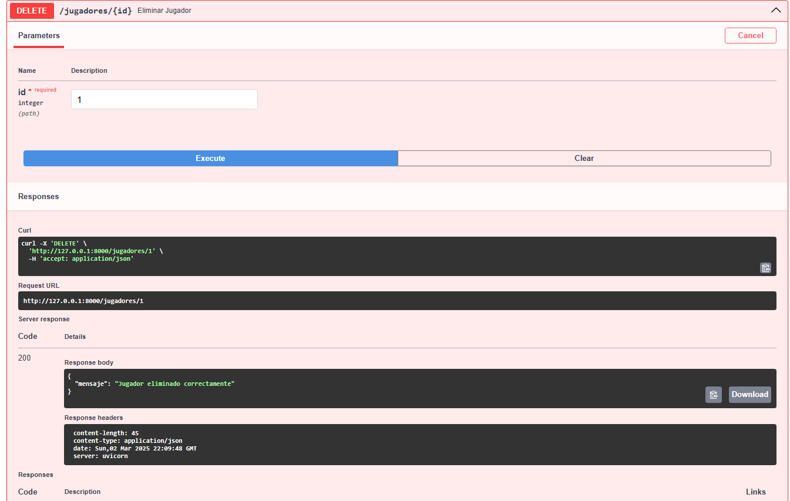
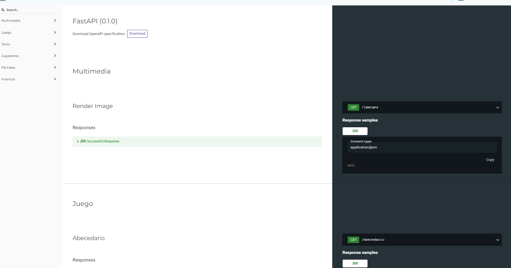
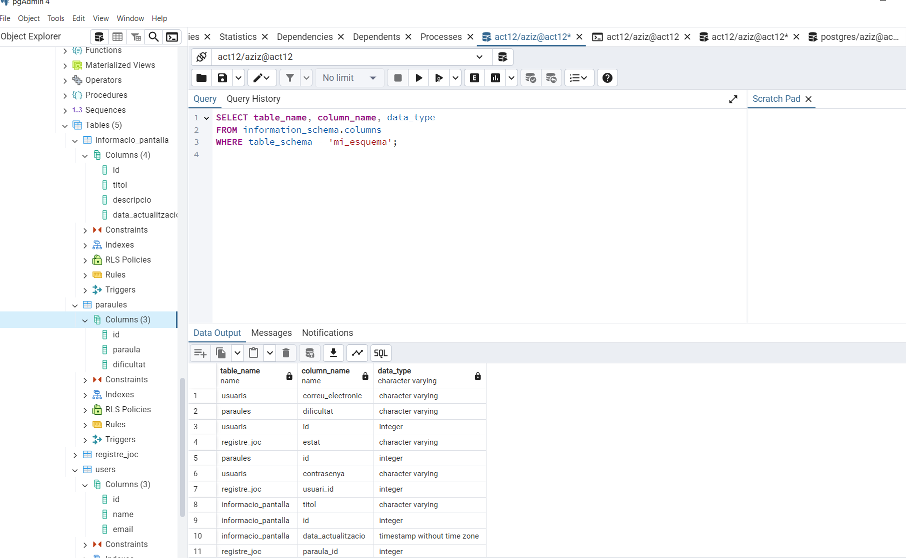
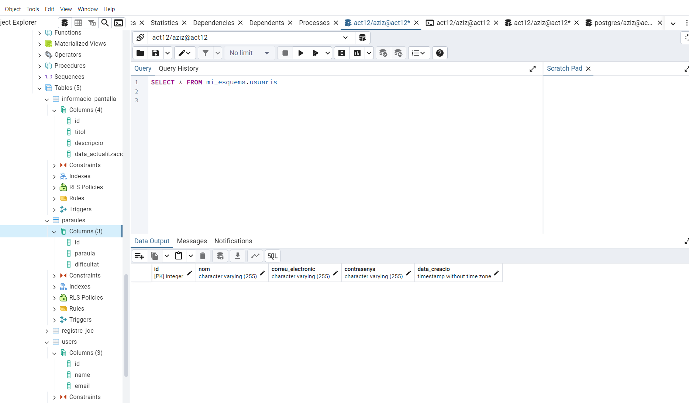

# Documentació Activitat 12

En aquesta secció, et mostrem les captures de pantalla de les taules a PGAdmin, i de tots el swaggers on pots veure la informació de la base de dades i les taules creades.

## Captures de Pantalla de PGAdmin i Swagger

### 1. **Tot el Crud de tot al swagger**
   Aquesta captura mostra la taula `usuaris` amb les dades que hem afegit a la base de dades. Aquesta vista et permet veure tots els registres existents.

   

### 2. **CREATE**
   Aquesta captura mostra com es veuen les taules de la base de dades a PGAdmin, permetent-te gestionar-les i visualitzar les dades de manera fàcil.

   

### 3. **READ**
   Aquesta captura mostra com es veuen les taules de la base de dades a PGAdmin, permetent-te gestionar-les i visualitzar les dades de manera fàcil.

   

### 4. **UPDATE**
   Aquesta captura mostra la taula `usuaris` amb les dades que hem afegit a la base de dades. Aquesta vista et permet veure tots els registres existents.

   

### 5. **Delete**
   Aquesta captura mostra la taula `usuaris` amb les dades que hem afegit a la base de dades. Aquesta vista et permet veure tots els registres existents.

   

### 6. **REDOC**
   Aquesta captura mostra la taula `usuaris` amb les dades que hem afegit a la base de dades. Aquesta vista et permet veure tots els registres existents.

   

### 1. **Taules al PGAdmin**
   Aquesta captura mostra com es veuen les taules de la base de dades a PGAdmin, permetent-te gestionar-les i visualitzar les dades de manera fàcil.

   

### 2. **Veure les Dades de la Taula Usuaris a PGAdmin**
   Aquesta captura mostra la taula `usuaris` amb les dades que hem afegit a la base de dades. Aquesta vista et permet veure tots els registres existents.

   

---

